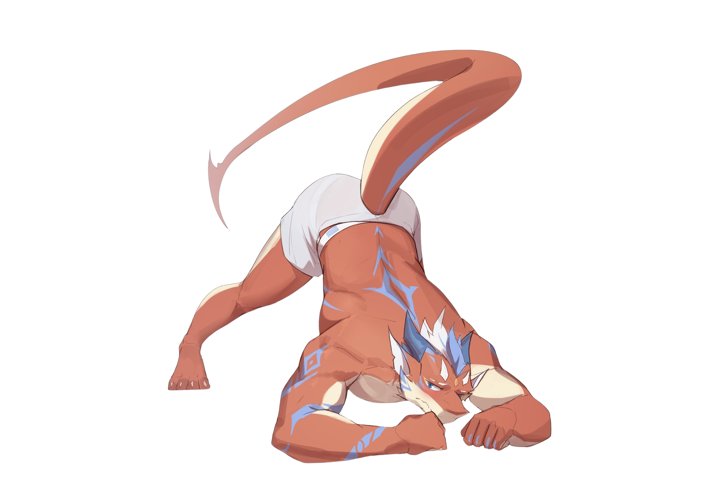

# Hellow I'm dheca :3

<!--
**dheca-haluw/dheca-haluw** is a ✨ _special_ ✨ repository because its `README.md` (this file) appears on your GitHub profile.

Here are some ideas to get you started:

- 🔭 I’m currently working on ...
- 🌱 I’m currently learning ...
- 👯 I’m looking to collaborate on ...
- 🤔 I’m looking for help with ...
- 💬 Ask me about ...
- 📫 How to reach me: ...
- 😄 Pronouns: ...
- ⚡ Fun fact: ...
-->

🌱 I’m currently learning Python, Git, GitHub, and web development :p

🧠 I’m looking for help with becoming a better programmer

🎮 Ask me about Python, games, or random tech stuff

⚡ Fun fact: i'm a furry hehehehee

### Skills

   

### Socials <3

 

<picture data-importer="pacman">
  <source media="(prefers-color-scheme: dark)" srcset="https://raw.githubusercontent.com/dheca-haluw/dheca-haluw/pacman-output/pacman-contribution-graph-dark.svg?game=pacman">
  <source media="(prefers-color-scheme: light)" srcset="https://raw.githubusercontent.com/dheca-haluw/dheca-haluw/pacman-output/pacman-contribution-graph.svg?game=pacman">
  
</picture>
